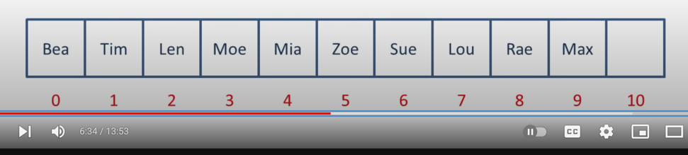

### Open Addressing

#### Strategies
- Linear Probing + Cycling back to beginning (can end up in linear search) [this implementation]

### Reference
- [Good Video](https://www.youtube.com/watch?v=KyUTuwz_b7Q)
- [Nice code](https://github.com/wang502/HashMap)