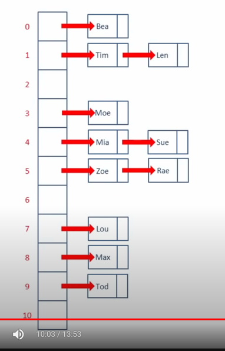

### Closed Addressing with Chaining

### Reference
- [Good Video](https://www.youtube.com/watch?v=KyUTuwz_b7Q)
- [Good Code - May be production ready](https://github.com/andreipimenov/hashmap/tree/master)
- [Beginner Code](https://github.com/rajpatil7322/HashMaps_in_golang_using_seperate_chaining_method)